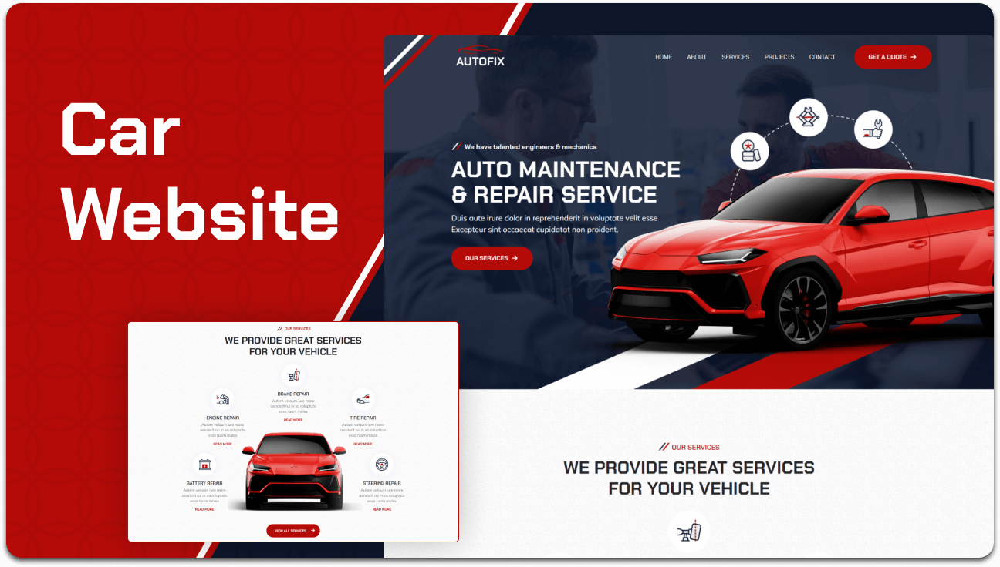

 

<!-- 🔰 BADGES -->

 

<!-- 🔰 PROJECT LOGO -->

 
 

<h1 align="center">🔧 Autofix Repairing Website</h1>

A modern, professional, and fully responsive  
**Auto Repair Service Website UI** built using **HTML, CSS, and JavaScript**.

<a href="https://autofix-repairing-website.vercel.app/"><strong>➥ Live Demo</strong></a>

---

<!-- TABLE OF CONTENTS -->

  
📑 Table of Contents

  <ol>
    <li><a href="#about-the-project">About The Project</a></li>
    <li><a href="#features">Features</a></li>
    <li><a href="#built-with">Built With</a></li>
    <li><a href="#contact">Contact</a></li>
  </ol>

---

## 📖 About The Project

The **Autofix Repairing Website** is a clean and professional automotive service website designed for car repair centers, garages, mechanics, and vehicle maintenance businesses. It combines modern UI elements with a structured layout to showcase repair services, business information, and customer trust in an engaging way.

The layout focuses on:
- Professional automotive service branding  
- Clear service presentation and business information  
- Smooth hover effects and modern UI interactions  
- Responsive design across all devices  

This project demonstrates your ability to build **business-focused service websites** that communicate professionalism, reliability, and user-friendly navigation while maintaining a polished visual experience.

Ideal for:
- Auto repair shops  
- Car service centers  
- Automotive workshops  
- Vehicle maintenance businesses  
- Responsive business website practice  

---

## ✨ Features

- Fully responsive automotive website layout  
- Professional and modern service-based UI  
- Hero section with business highlights  
- Services, About, Testimonials, and Contact sections  
- Smooth hover animations and transitions  
- Clean typography and structured layouts  

---

## 🛠️ Built With

This project is built using:

- **HTML5**  
- **CSS3**  
- **JavaScript (Vanilla)**  

---

## 📬 Contact

**Muhammad Salman Arshad**

- 💼 **LinkedIn:** https://www.linkedin.com/in/muhammad-salmanarshad/  
- 🎨 **Figma:** https://www.figma.com/@codewithsalman  
- 📧 **Email:** [msalmanwebdev@gmail.com](mailto:msalmanwebdev@gmail.com)

(<a href="#top">back to top</a>)

